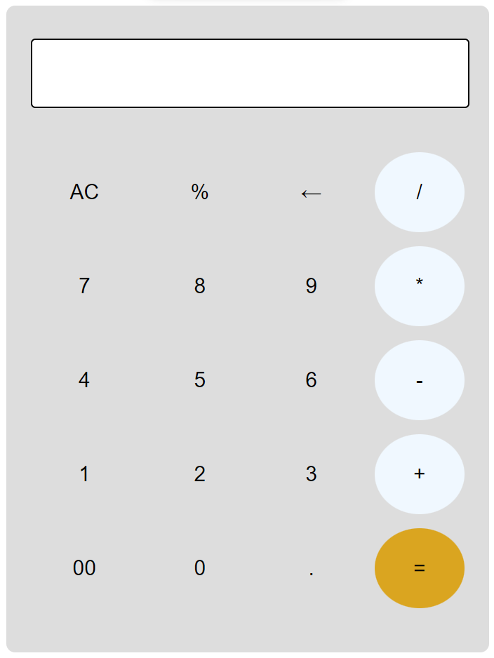

# Basic Calculator

This is a simple calculator built using JavaScript and HTML/CSS. It allows users to perform basic arithmetic calculations such as addition, subtraction, multiplication, and division.

## Features

- Addition: Perform addition calculations by entering two numbers and clicking the "+" button.
- Subtraction: Perform subtraction calculations by entering two numbers and clicking the "-" button.
- Multiplication: Perform multiplication calculations by entering two numbers and clicking the "*" button.
- Division: Perform division calculations by entering two numbers and clicking the "/" button.
- Clear: Clear the input fields and the result by clicking the "AC" button.

## Technologies Used

- JavaScript: Used to handle the logic and perform calculations.
- HTML: Used for creating the user interface and input fields.
- CSS: Used for styling the calculator and making it visually appealing.
- CSS Grid: Used for creating a responsive layout for the calculator.

## Screenshots

# basicCalculator
I have created a basic calculator using the eval function that uses the precedence order of Javascript and gives us the output of a specified mathematical operation.
